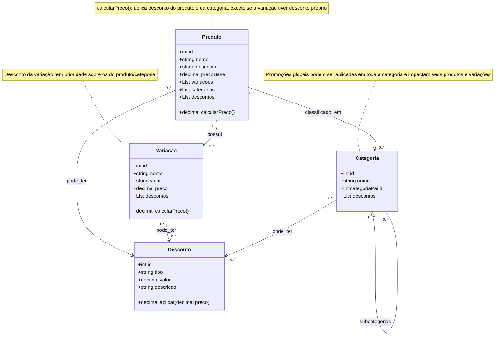

# Diagrama de Classes (UML)

* **Categoria** pode conter outras **Categorias** (herança/autoassociação).
* **Produto** pode ter várias **Variações**.
* **Produto** pode estar em múltiplas **Categorias** (associação N-N).

