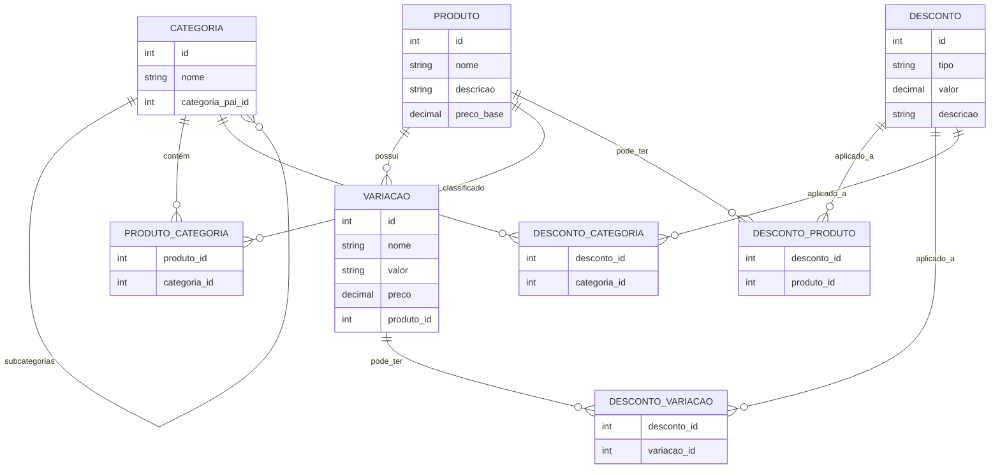

# Diagrama de Entidade-Relacionamento (DER)

* **CATEGORIA** pode ter **subcategorias** (auto-relacionamento).
* **PRODUTO** pode estar em **uma ou mais categorias** (tabela intermediária `PRODUTO_CATEGORIA`).
* **VARIACAO** pertence a um **PRODUTO** e pode sobrescrever o preço.

